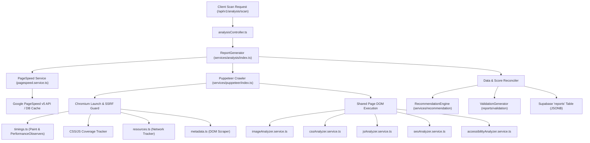

# PerfLens Analysis Engine: Comprehensive System Audit & Defect Catalog
**Date**: September 2026  
**Document ID**: `AUDIT_ENGINE_REPORT.md`  
**Status**: Completed Pre-Implementation Engine Audit  
**Scope**: Server-side crawling, sub-analyzers, scoring algorithms, recommendation rules, threshold classifications, telemetry provenance, and reporting pipelines.

---

## Executive Summary

An exhaustive audit of the entire PerfLens analysis engine codebase was conducted across all analyzers, services, helpers, controllers, test fixtures, and real-world report outputs (`google.com`, `news.ycombinator.com`, and `react.dev`).

The audit revealed multiple critical defects in truthfulness, measurement integrity, and data provenance:
1. **Critical Zero-Handling Bug in Vital Scoring**: In `server/services/analysis/index.ts`, `calcVitalScore` explicitly checked `if (val === 0) return 70`. Because `70` falls below the `90` threshold, perfect measurements of `CLS = 0` and `TBT = 0ms` (such as on `news.ycombinator.com`) were classified as **`NEEDS-IMPROVEMENT`** with score 70.
2. **False SEO Allegation on Google.com**: In `server/services/recommendation/rules.ts`, rule `REC_SEO_META` evaluated `missingTitle || missingDesc`. When Google had a valid `<title>Google</title>` but omitted a `<meta name="description">`, the rule triggered a combined recommendation claiming the title was unconfigured.
3. **Hardcoded Mock Fallbacks in Production Code**:
   - `server/services/analysis/helpers.ts` lines 79–86 contained a hardcoded `bundleAnalysis` array with static entries for `lodash`, `react-dom`, `moment.js`, `moment-timezone`, `framer-motion`, and `uuid`.
   - `server/services/analysis/index.ts` lines 167 & 222 hardcoded `fid: { score: 95, value: '12ms', rating: 'good' }`.
   - `server/services/jsAnalyzer/helpers.ts` and `cssAnalyzer/helpers.ts` used hardcoded 35% and 45% multipliers for "unused" code.
   - `server/services/recommendation/index.ts` bypassed real analyzer outputs with mock summary objects (`totalCSSFiles: 1`, `totalJSFiles: 1`).
4. **Incorrect Core Web Vitals Terminology**: FCP and TBT were labeled as "Core Web Vitals". Obsolete FID was hardcoded instead of reporting INP honestly as `N/A` for non-interactive lab crawls.
5. **Missing Evidence & Provenance**: Recommendations and accessibility warnings lacked DOM selectors, element snippets, and measurement sources.

---

## 1. Current Architecture & Analyzer Inventory



### Complete Analyzer List

| Analyzer | Service File | Input Data | Output Dimensions |
| :--- | :--- | :--- | :--- |
| **Puppeteer Crawler** | `services/puppeteer/index.ts` | Target URL, Chromium page | DOM tree, paint timings, raw requests, coverage |
| **Timings & Vitals** | `services/puppeteer/timings.ts` | PerformanceObserver entries | FCP, LCP, CLS, TBT, TTFB |
| **PageSpeed Insights** | `services/pagespeed.service.ts` | Google API v5 REST | Lighthouse categories, audit metrics, field data |
| **Network Analyzer** | `services/puppeteer/resources.ts`, `analysis/helpers.ts` | CDP network events | Requests, sizes, compression, cache status, waterfall |
| **Image Analyzer** | `services/imageAnalyzer/imageAnalyzer.service.ts` | `page.evaluate`, network items | Image list, dimensions, WebP/AVIF savings, alt text |
| **CSS Analyzer** | `services/cssAnalyzer/cssAnalyzer.service.ts` | Stylesheet tags, coverage | Rule count, sizes, coverage, render-blocking flags |
| **JavaScript Analyzer** | `services/jsAnalyzer/jsAnalyzer.service.ts` | Script tags, coverage | Script list, sizes, libraries, async/defer, coverage |
| **SEO Analyzer** | `services/seoAnalyzer/seoAnalyzer.service.ts` | DOM head & body inspection | Title, meta desc, canonical, robots, OG, Twitter, headings |
| **Accessibility Analyzer** | `services/accessibilityAnalyzer/accessibilityAnalyzer.service.ts` | DOM elements & attributes | Lang attribute, title, landmarks, form labels, image alts |
| **Recommendation Engine**| `services/recommendation/index.ts` | Reconciled findings | Prioritized, categorized actionable suggestions |
| **Report PDF Generator** | `services/report/index.ts`, `validationGenerator.ts` | Reconciled report object | Multi-page PDF report |

---

## 2. End-to-End Data Flow

1. **Request Ingestion**: `/api/v1/analysis/scan` receives `{ url, includePageSpeed }`.
2. **Concurrent Execution**:
   - `getPageSpeedTelemetry` queries the Google API (or Supabase 15-min cache).
   - `analyzeWebsiteWithPuppeteer` boots headless Chromium, injects PerformanceObservers into `evaluateOnNewDocument`, navigates to target with `waitUntil: 'networkidle2'`, stops coverage, and extracts DOM/network data.
3. **Sub-Analyzer Pass**: The active Puppeteer `page` and partial crawl result are passed to `analyzeImages`, `analyzeCSS`, `analyzeJavaScript`, `analyzeSEO`, and `analyzeAccessibility`.
4. **Reconciliation & Scoring (`ReportGenerator.generate`)**:
   - Computes category scores (`performance`, `accessibility`, `seo`, `bestPractices`) and composite `overall`.
   - Synthesizes recommendations via `RecommendationEngine.generate`.
5. **Persistence & QA Generation**:
   - Persists the report into Supabase `reports` table.
   - Calls `ValidationGenerator.generate` to write `reports/validation/validation-<domain>.json` and `.pdf`.

---

## 3. Scoring Flow & Formula Analysis

### Current Performance Scoring Formula
In `services/analysis/index.ts`:
- **When PageSpeed is available**:
  ```typescript
  scores = {
    performance: pageSpeedTelemetry.performance,
    accessibility: pageSpeedTelemetry.accessibility,
    seo: pageSpeedTelemetry.seo,
    bestPractices: pageSpeedTelemetry.bestPractices,
    overall: Math.round((performance + accessibility + seo + bestPractices) / 4)
  };
  ```
- **When PageSpeed is unavailable (Lab Fallback)**:
  ```typescript
  performanceScore = Math.round(
    fcpScore * 0.15 + lcpScore * 0.30 + tbtScore * 0.30 + clsScore * 0.25
  );
  overall = Math.round((performanceScore + accessibilityScore + seoScore + bestPracticesScore) / 4);
  ```
- **The Vital Scoring Bug**:
  ```typescript
  const calcVitalScore = (val: number | null, good: number, bad: number) => {
    if (val === null || val === undefined || val === 0) return 70; // <-- FATAL: 0 treated as missing!
    if (val <= good) return 100;
    if (val >= bad) return 30;
    return Math.round(100 - ((val - good) / (bad - good)) * 70);
  };
  ```

### Current SEO Scoring Formula
In `services/seoAnalyzer/helpers.ts`:
- Static addition: Title (+20), Meta Description (+20), Language (+15), Viewport (+15), robots.txt (+15), sitemap.xml (+15). Max = 100.
- Missing transparent formula explanation or finding attribution in report JSON/PDF.

### Current Accessibility Scoring Formula
In `services/accessibilityAnalyzer/accessibilityAnalyzer.service.ts`:
- Lang (+15), Page Title (+15), Skip link (+10), Form labels ratio (+20), Button labels ratio (+15), Image alts ratio (+15), Landmarks (+10).
- Rigid skip-link penalty for sites where skip navigation is not applicable.

### Current Best Practices Scoring Formula
- Starts at 100, subtracts:
  - `duplicateScripts * 5`
  - `duplicateStylesheets * 5`
  - `unminifiedJS * 2`
  - `unminifiedCSS * 2`
  - Clamped between 50 and 100. Deductions lack traceable finding objects.

---

## 4. Recommendation Flow & Rules Analysis

In `server/services/recommendation/`:
- `rules.ts` contains 18 recommendation rules (`REC_PERF_LCP`, `REC_PERF_CLS`, `REC_SEO_META`, etc.).
- **Defects in Rule Triggers**:
  1. `REC_SEO_META`: Triggers on `missingTitle || missingDesc`. If only the description is missing, it recommends fixing both title and description.
  2. `REC_PERF_TBT`: Fixed string `"Improves First Contentful Paint by up to 200ms"`, conflating TBT with FCP.
  3. Lack of direct evidence: Recommendations do not cite the exact offending element, selector, or rule failure.
  4. Disconnected Input: `RecommendationEngine.generate` in `services/recommendation/index.ts` was passing fake wrapper objects with `totalCSSFiles: 1` and `totalJSFiles: 1` instead of using the real data from the crawler.

---

## 5. Detailed Defect Catalog: Hardcoded & Mock Values

| Location | Hardcoded / Mock Value | Impact |
| :--- | :--- | :--- |
| `services/analysis/index.ts:120` | `if (val === 0) return 70;` | Classifies `CLS = 0` and `TBT = 0ms` as `needs-improvement` (Score: 70). |
| `services/analysis/index.ts:167, 222` | `fid: { score: 95, value: '12ms', rating: 'good' }` | Injects fictitious 12ms FID on headless runs. |
| `services/analysis/index.ts:213-238` | `'1.5s'`, `'2.8s'`, `'0.02'`, `'0.3s'`, `'150ms'` | Injects fake metric strings when crawler vitals are falsy. |
| `services/analysis/helpers.ts:7-8` | `sizeKb: img.sizeKb \|\| 20; format: img.format \|\| 'PNG'` | Fabricates image sizes and formats if not populated. |
| `services/analysis/helpers.ts:46` | `unusedKb: parseFloat((sizeKb * 0.45).toFixed(1))` | Assumes exactly 45% of all CSS is unused. |
| `services/analysis/helpers.ts:77` | `unusedKb: parseFloat((sizeKb * 0.35).toFixed(1))` | Assumes exactly 35% of all JS is unused. |
| `services/analysis/helpers.ts:79-86` | Hardcoded `bundleAnalysis` array (`lodash`, `react-dom`, `moment.js`, etc.) | Injects static packages into every scan that uses this helper. |
| `services/jsAnalyzer/helpers.ts:31` | `if (urlLower.includes('vue')) return 'Vue';` | Falsely flags URLs with substring 'vue' (e.g. `YV5bee` in Google script). |
| `services/jsAnalyzer/helpers.ts:50, 64-66`| `sizeKb * 0.35`, `0.4ms/KB`, `0.8ms/KB` | Fabricated execution and parsing times. |
| `services/cssAnalyzer/helpers.ts:33` | `!cc.includes('public') \|\| sizeKb > 50` | Uses HTTP cache header as heuristic for render-blocking CSS. |
| `services/pagespeed/index.ts:39-41` | `maxFid < 100 ? 98 : 70`, `Math.round(maxFid * 0.4)ms` | Fabricated FID score and display values. |
| `services/puppeteer/timings.ts:93-95` | `dnsLookupMs: dns > 0 ? dns : 10`, `tcpConnectionMs: connect > 0 ? connect : 15` | Substitutes 10ms and 15ms for zero/missing measurements. |
| `services/puppeteer/timings.ts:151-158` | Hardcoded fallback timing numbers (`15, 25, 10, 90, 180, 240, 650, 1200`) | Fictitious navigation timings returned on error. |
| `services/recommendation/index.ts:24-41`| `totalCSSFiles: 1`, `totalJSFiles: 1` | Feeds fabricated summary structures into recommendation generator. |

---

## 6. Investigation of Regression Reports

### A. `news.ycombinator.com` Report Investigation
- **Observed in Report**:
  ```json
  "cls": { "score": 70, "value": "0", "rating": "needs-improvement" },
  "tbt": { "score": 70, "value": "0 ms", "rating": "needs-improvement" }
  ```
- **Root Cause**: In `calcVitalScore`, the condition `if (val === null || val === undefined || val === 0)` erroneously trapped valid numerical `0` as an unmeasured/missing state and returned `70`. Since 70 is in the range `[50, 89]`, the rating logic assigned `needs-improvement`.
- **Target Correct Behavior**: For CLS, `0 <= 0.1` is **GOOD** (Score 100). For TBT, `0ms <= 200ms` is **GOOD** (Score 100).

### B. `google.com` Report Investigation
- **Observed in Report**:
  ```json
  "category": "seo",
  "issue": "Configure page title and meta description descriptors"
  ```
- **Root Cause**: `google.com` has `<title>Google</title>` (extracted properly by the DOM scraper), but omits `<meta name="description">`. Rule `REC_SEO_META` in `rules.ts` lumped both checks together (`missingTitle || missingDesc`).
- **Target Correct Behavior**: Split into two distinct rules:
  1. `REC_SEO_TITLE`: Missing `<title>` tag (only triggers if title is genuinely missing).
  2. `REC_SEO_META_DESC`: Missing `<meta name="description">` tag (only triggers if description is missing).

---

## 7. Terminology & Source Provenance Deficiencies

| Current Usage in Code / Reports | Why It Is Incorrect | Target Replacement |
| :--- | :--- | :--- |
| Grouping LCP, FCP, CLS, TBT as "Core Web Vitals" | Official Google CWV are **LCP, INP, CLS**. FCP and TBT are lab/performance metrics. | Separate into: <br>1. **Core Web Vitals** (LCP, INP, CLS)<br>2. **Other Performance Metrics** (FCP, TBT, TTFB). |
| Fabricating FID `12ms` | Headless Chrome has no real user interaction. FID is obsolete (deprecated March 2024). | **INP: N/A** with explicit explanation: *"Interaction to Next Paint requires real or synthetic user input events (not applicable in non-interactive lab crawl)"*. |
| "Core Web Vitals Telemetry" label | "Telemetry" misleadingly implies real-user field data (RUM/CrUX). | **"Lab Performance Metrics (PerfLens Browser Measurement)"** |
| Merged/unlabeled scores in PDF | Does not state whether score came from Lighthouse or PerfLens crawler. | Include explicit source metadata: `source: 'lighthouse' \| 'puppeteer'`, `mode: 'lab'`. |

---

## 8. Proposed Architectural Fixes

### A. Centralized Threshold & Classification Module
Create `server/config/performanceThresholds.ts` as the single source of truth for:
- Authoritative thresholds based on official Google web.dev criteria:
  - **LCP**: Good `[0, 2500ms]`, Needs Improvement `(2500, 4000ms]`, Poor `> 4000ms`.
  - **CLS**: Good `[0, 0.1]`, Needs Improvement `(0.1, 0.25]`, Poor `> 0.25`.
  - **INP**: Good `[0, 200ms]`, Needs Improvement `(200, 500ms]`, Poor `> 500ms`.
  - **FCP**: Good `[0, 1800ms]`, Needs Improvement `(1800, 3000ms]`, Poor `> 3000ms`.
  - **TBT**: Good `[0, 200ms]`, Needs Improvement `(200, 600ms]`, Poor `> 600ms`.
  - **TTFB**: Good `[0, 800ms]`, Needs Improvement `(800, 1800ms]`, Poor `> 1800ms`.
- Centralized classification function:
  ```typescript
  export const classifyMetric = (metric: MetricType, value: number | null | undefined): MetricClassification;
  ```
  Strictly handling: `null`, `undefined`, `NaN`, `0`, and boundary values with unit tests.

### B. Standardized Analyzer Contract & Evidence Model
Every finding will adhere to a unified schema:
```typescript
interface AnalyzerFinding {
  id: string;
  analyzer: 'seo' | 'accessibility' | 'images' | 'css' | 'javascript' | 'network' | 'performance';
  rule: string;
  status: 'PASS' | 'FAIL' | 'WARNING' | 'UNAVAILABLE';
  rawValue: any;
  expected: string;
  evidence: {
    selector?: string;
    snippet?: string;
    attribute?: string;
    details?: any;
  };
  scoreContribution: number;
  confidence: 'HIGH' | 'MEDIUM' | 'LOW' | 'UNAVAILABLE';
}
```

### C. Honest Estimations & Data Status
- When data is genuinely missing or measurement is unavailable, report `UNAVAILABLE` or `N/A` with an explicit reason string. Never fall back to arbitrary constants (e.g. `20KB`, `35%`, `45%`, `12ms`).
- In recommendations, if improvement cannot be mathematically calculated from actual measured metrics, report `"Impact not reliably quantifiable"` rather than invented percentages.

---

## 9. Files Requiring Modification & Risk Assessment

| File | Changes Required | Risk & Mitigation |
| :--- | :--- | :--- |
| **`server/config/performanceThresholds.ts`** [NEW] | Centralize all CWV and performance metric thresholds, units, classifications, and score mapping. | **Low**: Pure functional module with comprehensive unit tests. |
| **`server/services/analysis/index.ts`** | Fix `calcVitalScore` zero bug; remove mock FID; separate CWV from Other Metrics; pass real analyzer outputs into recommendation engine; add source attribution. | **Medium**: Core orchestrator. Mitigate with regression test suite comparing before/after outputs. |
| **`server/services/analysis/helpers.ts`** | Remove hardcoded fake `bundleAnalysis` array, remove hardcoded 35%/45% heuristics, handle genuine 0 image size. | **Low**: Helper classes used for legacy data normalization. |
| **`server/services/puppeteer/timings.ts`** | Remove hardcoded DNS/TCP numbers; remove fallback fake timings; implement robust session-window CLS and explicit TBT. | **Medium**: Browser evaluation. Protect with try/catch and explicit `null` returns when evaluation fails. |
| **`server/services/seoAnalyzer/`** | Ensure findings include selector, extracted text, and DOM snippet. Decouple title check from meta description check. | **Low**: Enhances existing DOM scraping without altering signatures. |
| **`server/services/accessibilityAnalyzer/`** | Attach real DOM element snippets, selectors, and WCAG criteria to warnings. Make skip-link optional/contextual. | **Low**: Enriches warning payloads with concrete evidence. |
| **`server/services/cssAnalyzer/helpers.ts`** | Base render-blocking check on stylesheet `media` and DOM properties rather than cache headers; return `N/A` for unused CSS if coverage unmeasured. | **Low**: Corrects CSS heuristics. |
| **`server/services/jsAnalyzer/helpers.ts`** | Fix `detectCommonLibrary` word boundary regex so random hashes don't trigger 'Vue'; return unmeasured for execution costs if unsupported. | **Low**: Eliminates false library detections. |
| **`server/services/recommendation/rules.ts`** | Split `REC_SEO_META` into `REC_SEO_TITLE` and `REC_SEO_META_DESC`; require real analyzer findings to trigger recommendations. | **Medium**: Recommendation logic. Tested against `google.com` and `news.ycombinator.com`. |
| **`server/services/recommendation/index.ts`** | Eliminate mock objects (`totalCSSFiles: 1`, etc.); consume real analyzer results. | **Low**: Directly feeds authentic crawl outputs. |
| **`server/services/report/index.ts`** | Update PDF generator to separate Core Web Vitals from Other Lab Metrics; display source provenance and evidence. | **Low**: Visual identity preserved; only textual labels and data bindings enriched. |
| **`src/pages/ResultsPage.tsx`** | Align labels with "Core Web Vitals" vs "Other Performance Metrics"; show INP as N/A in lab crawl; maintain exact existing UI layout/styling. | **Low**: UI layout/visuals untouched; only metric labels/data mapping clarified. |

---

## 10. Audit Verification Baseline

The following golden test benchmarks are established as mandatory quality gates before the engine is declared production-ready:
1. **`news.ycombinator.com`**:
   - `CLS = 0` MUST be classified as **`good`** (Score: 100).
   - `TBT = 0ms` MUST be classified as **`good`** (Score: 100).
   - No mock FID displayed.
2. **`google.com`**:
   - Title MUST be recognized as present: `<title>Google</title>`.
   - The recommendation MUST NOT say "Configure page title and meta description descriptors" — it may only recommend adding a meta description if one is missing.
   - Script `m=...` MUST NOT be falsely identified as Vue.js.
3. **Synthetic Deterministic Fixtures**:
   - Boundary tests for `CLS` (0, 0.05, 0.10, 0.101, 0.25, 0.251, 1.0).
   - Boundary tests for `TBT` (0, 100, 200, 201, 600, 601, 2000).
   - Null, undefined, and NaN inputs must return `UNAVAILABLE` without crashing.
