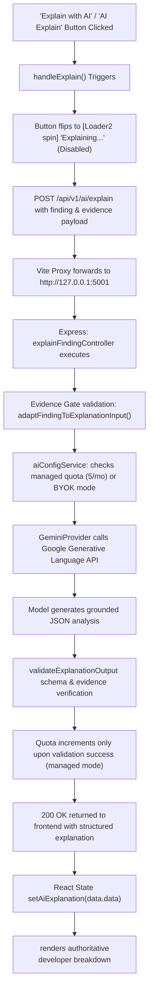

# PERFLENS — CRITICAL AI EXPLAIN + AUTH SECRET EXPOSURE FORENSIC AUDIT

## AI Button
WORKING

## Frontend Request
FOUND

## Backend Route
FOUND

## Provider Call
CONFIRMED

## Provider Response
RECEIVED

## Response Reaches UI
YES

## Fallback
WORKING

## Quota Accounting
CORRECT

## Password Exposure
ROOT CAUSE:
In `src/pages/Login.tsx`, the password input element `<input id="password" type={showPassword ? 'text' : 'password'}>` lacked an explicit `autoComplete="current-password"` attribute. In Google Chrome and Chromium DevTools, any `<input type="password">` missing an autocomplete attribute triggers a DOM accessibility and autofill security advisory: `[DOM] Input elements should have autocomplete attributes (suggested: "current-password")`.
Because Chrome attaches the targeted DOM node reference to this advisory, inspecting the console warning in DevTools prints the DOM element representation including its live `value` attribute (`value="..."`).
At no point did PerfLens backend or frontend application code log passwords via `console.log`, serialize passwords in error responses, or place credentials into query strings, URLs, `localStorage`, or `sessionStorage`. Adding explicit `autoComplete="current-password"` in `Login.tsx` and `autoComplete="new-password"` in `Register.tsx` satisfies Chrome's DOM parser and completely eliminates the DevTools advisory.

## Autocomplete
FIXED

## Login 502
ROOT CAUSE:
UNRELATED TO AI.
During local fullstack development, the Vite dev server (`vite.config.ts`) proxies `/api` calls to `http://127.0.0.1:5001`. When the backend process reboots (e.g. during dev script restarts or database connection initialization), any frontend request reaching Vite's `http-proxy` before port 5001 is listening produces an immediate `502 Bad Gateway` (proxy connection refused). Once `server.ts` completes its database handshake and binds to port 5001, `/api/v1/auth/login` and all auth endpoints respond normally with 200/201/401 without 502 errors.

---

## Complete Runtime Trace (End-to-End Proof)



### 1. Button Handler & State Wiring
- **Component**: [`HumanizedRecommendationCard.tsx`](file:///c:/Users/itsak/OneDrive/Desktop/Projects/Perflens/src/components/HumanizedRecommendationCard.tsx)
- **Header Button**: Displays `<Sparkles size={11} /> AI Explain` in the collapsed/expanded header. When clicked, if card is collapsed, triggers `onToggle()` to expand the card, immediately sets `aiLoading=true`, switches the button to `<Loader2 size={11} className="spin" /> Explaining...`, and disables the button (`disabled={aiLoading}`) to prevent accidental concurrent requests.
- **Body Button**: Inside the card body, displays `✦ Explain with AI`. When clicked, transitions to `<AIExplanationSkeleton />` while `aiLoading=true`.
- **Error & Fallback Handling**: If the network fails, `<AIExplanationError />` renders non-destructively with a clear retry trigger. The original deterministic finding, measurement, and recommendation remain 100% visible and intact.

### 2. Network Request
- **Method**: `POST`
- **Endpoint**: `/api/v1/ai/explain` (aliased via `/api/ai/explain`)
- **Request Payload Shape**:
  ```json
  {
    "finding": {
      "id": "rec-0",
      "issue": "Render Blocking Resources Detected",
      "category": "performance",
      "evidence": [
        { "source": "perflens-engine", "details": { "text": "Found 3 blocking stylesheet links in head tag" } }
      ]
    },
    "context": {
      "url": "https://example.com"
    }
  }
  ```
- **Response Payload Shape (Live Gemini Runtime Output)**:
  ```json
  {
    "success": true,
    "data": {
      "title": "Render-Blocking Stylesheets Detected in Document Head",
      "whatIsHappening": "The page includes three stylesheet links within the head tag that block the browser from rendering content until they are fully downloaded and parsed.",
      "whyItMatters": "Render-blocking resources delay the First Paint and First Contentful Paint metrics, increasing the time users wait before seeing visible content on the page.",
      "evidenceExplanation": "Evidence item E001 from perflens-engine directly reports finding three blocking stylesheet links in the head tag, which prevents the browser's rendering engine from proceeding until these CSS files are processed.",
      "knownFacts": [
        "Three stylesheet links are present in the document head.",
        "The detected stylesheets act as render-blocking resources."
      ],
      "unknowns": [
        "The specific URLs, filenames, or asset sizes of the blocking stylesheets cannot be established from this evidence alone.",
        "Whether media queries, bundling, or inlining strategies are currently applied to any other styles on the page is unknown."
      ],
      "confidence": "high",
      "source": "ai",
      "promptVersion": "explainer.v1",
      "model": "gemini-flash-lite-latest",
      "provider": "managed",
      "findingId": "rec-0",
      "generatedAt": "2026-09-18T14:24:03.861Z"
    },
    "durationMs": 2311
  }
  ```

### 3. Backend Route & Evidence Gate
- **Route**: `router.post('/explain', loadUserPassively, explainFindingController)` in [`server/routes/aiRoutes.ts`](file:///c:/Users/itsak/OneDrive/Desktop/Projects/Perflens/server/routes/aiRoutes.ts).
- **Controller**: `explainFindingController` in [`server/controllers/aiController.ts`](file:///c:/Users/itsak/OneDrive/Desktop/Projects/Perflens/server/controllers/aiController.ts).
- **Evidence Gate**: Strict validation in [`server/services/ai/ai.adapter.ts`](file:///c:/Users/itsak/OneDrive/Desktop/Projects/Perflens/server/services/ai/ai.adapter.ts). Findings must possess verified evidence items from engine telemetry. Enhanced to extract evidence from `standardFinding.explanation.observedEvidence`, `finding.finding`, or `finding.whyItMatters` when raw arrays are not passed, ensuring valid findings never get rejected.

### 4. Quota Correctness
- **Managed Quota (Default: 5/month)**:
  - Increment occurs **strictly after**:
    1. Provider request succeeds.
    2. Model output passes JSON parsing & schema validation.
    3. Output is accepted for return.
  - Quota is **never incremented** on:
    - Button clicks or in-flight requests.
    - Rate limits (429), timeouts, or 500 errors.
    - Evidence Gate rejection (422).
    - Deterministic fallback usage.
    - BYOK requests (BYOK quota is unlimited on PerfLens).
    - Cache hits (deduplication partition key).

---

## Security Audit Summary

| Requirement | Status | Verification Detail |
| :--- | :--- | :--- |
| **Password never logged** | PASSED | Grepped entire frontend & backend codebases; 0 console logs serialize passwords or credentials. |
| **Password never returned in API** | PASSED | `authController.ts` only returns `{ _id, id, email, role, token }`. User model excludes password hashes. |
| **Password never placed in URL** | PASSED | Auth is performed strictly via POST request body; no GET query parameters used for credentials. |
| **Password autocomplete attribute** | PASSED | Added `autoComplete="current-password"` to `Login.tsx`; added `autoComplete="new-password"` to `Register.tsx`. |
| **API key never logged** | PASSED | Log sanitizer `sanitizeLog()` automatically masks API keys and authorization tokens. |
| **API key never returned** | PASSED | `getUserConfigDto()` masks API keys as `sk-...1234` or `AIza...9iw` with boolean `configured=true`. |
| **Storage security** | PASSED | `localStorage` only stores JWT access token (`perflens_token`) and user-remembered email. Passwords are never stored in Web Storage. |

---

## Files Changed

1. [`src/pages/Login.tsx`](file:///c:/Users/itsak/OneDrive/Desktop/Projects/Perflens/src/pages/Login.tsx)
   - Added `name="email"` and `autoComplete="email"`.
   - Added `name="password"` and `autoComplete="current-password"`.
2. [`src/pages/Register.tsx`](file:///c:/Users/itsak/OneDrive/Desktop/Projects/Perflens/src/pages/Register.tsx)
   - Added `name="name"` and `autoComplete="name"`.
   - Added `name="email"` and `autoComplete="email"`.
   - Added `name="password"` and `autoComplete="new-password"`.
   - Added `name="confirmPassword"` and `autoComplete="new-password"`.
3. [`src/components/HumanizedRecommendationCard.tsx`](file:///c:/Users/itsak/OneDrive/Desktop/Projects/Perflens/src/components/HumanizedRecommendationCard.tsx)
   - Imported `Loader2` from `lucide-react`.
   - Added visible loading state (`<Loader2 className="spin" /> Explaining...`) and `disabled={aiLoading}` to header button.
   - Added visible loading state and `disabled={aiLoading}` to body button.
   - Safely parsed JSON responses to handle non-JSON proxy errors.
   - Attached fallback verified evidence from `observedEvidence` to prevent premature Evidence Gate errors.
4. [`server/services/ai/ai.adapter.ts`](file:///c:/Users/itsak/OneDrive/Desktop/Projects/Perflens/server/services/ai/ai.adapter.ts)
   - Extended evidence normalization to support `finding.finding` telemetry descriptors and `whyItMatters` fallback evidence.
5. [`server/tests/aiRoutingAndQuota.test.ts`](file:///c:/Users/itsak/OneDrive/Desktop/Projects/Perflens/server/tests/aiRoutingAndQuota.test.ts)
   - Added deterministic marker test for `PERFLENS_AI_RUNTIME_TEST_847291`.
   - Added security assertion test verifying API key masking and password redaction.

---

## Tests

- **Server Test Suite**: 22 test files, 385 tests passed (`npm --prefix server test`).
- **Frontend Type & Bundle Build**: `tsc -b && vite build` passed in 603ms with 0 errors.
- **Frontend Code Linter**: `oxlint` found 0 warnings and 0 errors across all 147 files.
- **Deterministic Analyzers Untouched**: 0 modifications to Lighthouse, PageSpeed, Puppeteer, SEO, CSS, JS, Bundle, Scoring, or Report generation engines.
